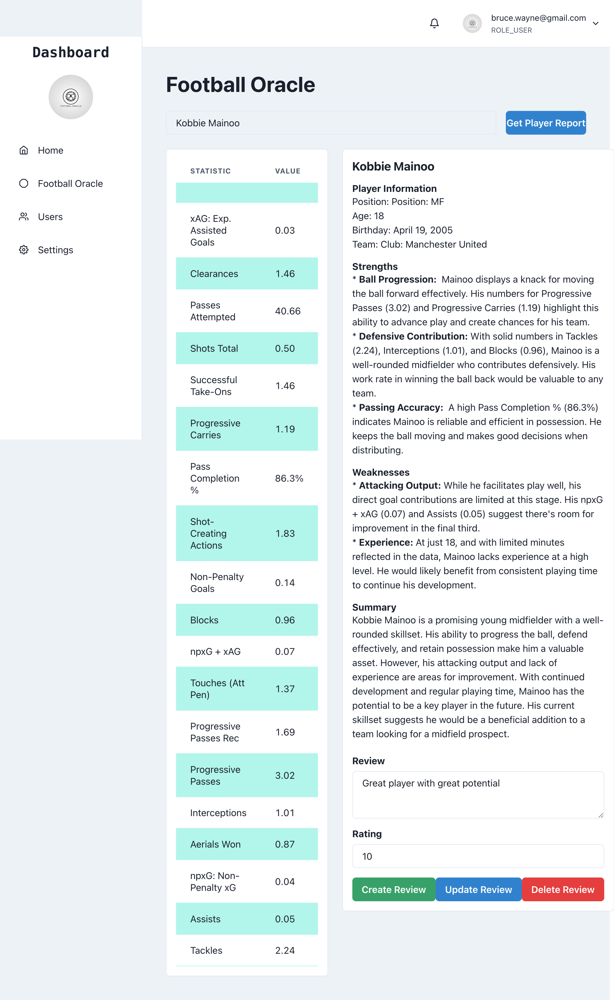

# Football Oracle: Your AI-Powered Scouting Companion

Football Oracle is a cutting-edge web application that transforms the way football enthusiasts and professionals gather player insights. By leveraging advanced AI and natural language processing, Football Oracle provides comprehensive, data-driven football player analytics on demand.  Whether you're a football fan, a fantasy football manager, or a just a freak loving this game as I do, Football Oracle empowers you with the knowledge you need and elevate your understanding of this beautiful game.

## Key Features

* Intuitive Player Search: Easily find detailed scouting reports on any football player, from rising stars to seasoned veterans.
* AI-Generated Analytics: Receive comprehensive player analyses, including strengths, weaknesses, and potential impact on the team.
* Personalized Ratings and Reviews: Share your own expert opinions by rating and commenting on reports, fostering a vibrant community of football enthusiasts.
* Robust User Profiles: Manage your personal information, track your rating history, and update your reviews with ease.
* Community Interaction: Explore the ratings and comments of other users to gain diverse perspectives and insights.

## How It Works

1. Login or Sign Up: Create a free account to access the full suite of Football Oracle features.
2. Search for Players: Use the intuitive search bar to find the player you're interested in.
3. Explore Scouting Reports: Dive into AI-generated analytics that provide in-depth analysis of player attributes, statistics, and performance.
4. Rate and Review: Share your thoughts by rating reports and leaving comments, contributing to a growing knowledge base for the community.
5. Connect with Others: Browse the profiles of other users to discover new players and learn from their insights.

## Functional and Non-Functional Requirements
Please see the [Functional and Non-Functional Requirements](adr/FR_and_NFR_list.md) for detailed information on the features and performance goals of Football Oracle.

## Use Cases
Please see the [Use Cases](adr/use_cases.md) for detailed information on the use cases of Football Oracle.

## Object and Classes
Please see the [Object and Classes](adr/object_and_classes.md) for detailed information on the object and classes of Football Oracle.

## Entity Relationship Diagram
Please see the [Entity Relationship Diagram](adr/ER_diagram.md) for detailed information on the entity relationship diagram of Football Oracle.

## Project Structure

```
📂 sabit-shaiholla/football-oracle/ - central repository of the project
├── 📂 adr/ - store of architectural decision records (ADRs)
├── 📂 backend/ - backend of the project (Spring Boot)
│   ├── 📂 src/ - source folder of BE project
│   │   ├── 📂 main/java/com.oracle.football - main package of the project
│   │   │   ├── 📂 controller/ - controllers of the project
│   │   │   ├── 📂 config/ - configurations of the project
│   │   │   ├── 📂 dto/ - data transfer objects of the project
│   │   │   ├── 📂 exception/ - exceptions of the project
│   │   │   ├── 📂 jwt/ - JWT configurations of the project
│   │   │   ├── 📂 security/ - security configurations of the project
│   │   │   ├── 📂 model/ - models of the project
│   │   │   ├── 📂 repository/ - repositories of the project
│   │   │   ├── 📂 service/ - services of the project
│   │   │   └── 📂 FootballApplication.java - entry point of the project
│   │   ├── 📂 resources/ - resources folder of main package of BE project
│   │   │   ├── 📂 application.yaml - configurations of the project
│   │   │   └── 📂 db/migration - database migration scripts
│   │   ├── 📂 test/java/com.oracle.football - test package of the project
│   │   │   ├── 📂 Player/ - tests related to Player entity
│   │   │   ├── 📂 User/ - tests related to User entity
│   │   │   ├── 📂 PlayerReport/ - tests related to PlayerReport entity
│   │   │   └── 📂 FootballApplicationTests.java - entry point of the tests
│   └── 📂 pom.xml - dependencies of the project
└── 📂 frontend/ - frontend of the project (HTML, CSS, JavaScript)
    └── 📂 football-oracle-fe/ - frontend of the project on React
        ├── 📂 src/ - source folder of FE project
        │   ├── 📂 components/ - components of the project
        │   ├── 📂 services/ - services of the project
        │   ├── 📂 assets/ - assets of the project
        │   ├── 📂 Home.jsx - Home page component of the project
        │   ├── 📂 main.jsx - entry point of the project
        │   └── 📂 User.jsx - User page component of the project
        ├── 📂 package.json - dependencies of the project
        └── 📂 README.md - readme for FE of the project
    
```

## Example view of the project


## Architecture

1. User Interaction
* Users interact with the Front-End application.
* Users can search for players, view reports, and add reviews
2. Front-End Application
* The React app sends requests to the Back-End using RESTful APIs.
* It handles routing, state management, and UI rendering. 
3. Back-End Application
* The Spring Boot application processes requests from the Front-End.
* It handles business logic, data validation, and communication with the database.
* Controllers manage endpoints for user authentication, player data retrieval, and reviews.
* Services contain the business logic.
* Repositories interact with the PostgreSQL database.
4. Data Fetching Logic
* Database Check: The Back-End checks the PostgreSQL database for player data.
* Fetch from WebPage: If data is not present, it fetches data from the WebPage (FBREF.com).
* Fetch from Gemini Pro API: After getting data from the WebPage, it requests player reports via external API. 
* Save to Database: The fetched data and reports are saved in the database for future queries.
5. External API Interaction
* The Back-End interacts with Gemini Pro API to fetch and process player data when not found in the database.

## Technology Stack

* Front-End: HTML, CSS, JavaScript
* Back-End: Spring Boot (Java)
* Database: PostgreSQL
* External API: Gemini Pro API (Google)

## Contributing
I welcome contributions from the community! If you're a football enthusiast, data scientist, or developer, there are plenty of ways to get involved.

## Get Started

Ready to elevate your football knowledge? Visit Football Oracle today and experience the future of football analytics.
[Link to deployed app - TBD]