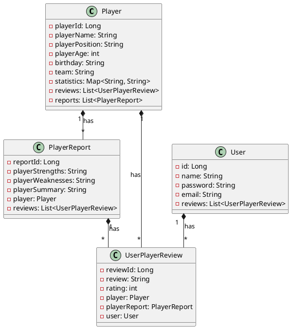

```plantuml
@startuml

top to bottom direction
skinparam linetype ortho

class Player {
  - playerId: Long
  - playerName: String
  - playerPosition: String
  - playerAge: int
  - birthday: String
  - team: String
  - statistics: Map<String, String>
  - reviews: List<UserPlayerReview>
  - reports: List<PlayerReport>
}

class PlayerReport {
  - reportId: Long
  - playerStrengths: String
  - playerWeaknesses: String
  - playerSummary: String
  - player: Player
  - reviews: List<UserPlayerReview>
}

class User {
  - id: Long
  - name: String
  - password: String
  - email: String
  - reviews: List<UserPlayerReview>
}

class UserPlayerReview {
  - reviewId: Long
  - review: String
  - rating: int
  - player: Player
  - playerReport: PlayerReport
  - user: User
}

Player "1" *-- "*" PlayerReport: has
Player "1" *-- "*" UserPlayerReview: has
PlayerReport "1" *-- "*" UserPlayerReview: has
User "1" *-- "*" UserPlayerReview: has

@enduml
```