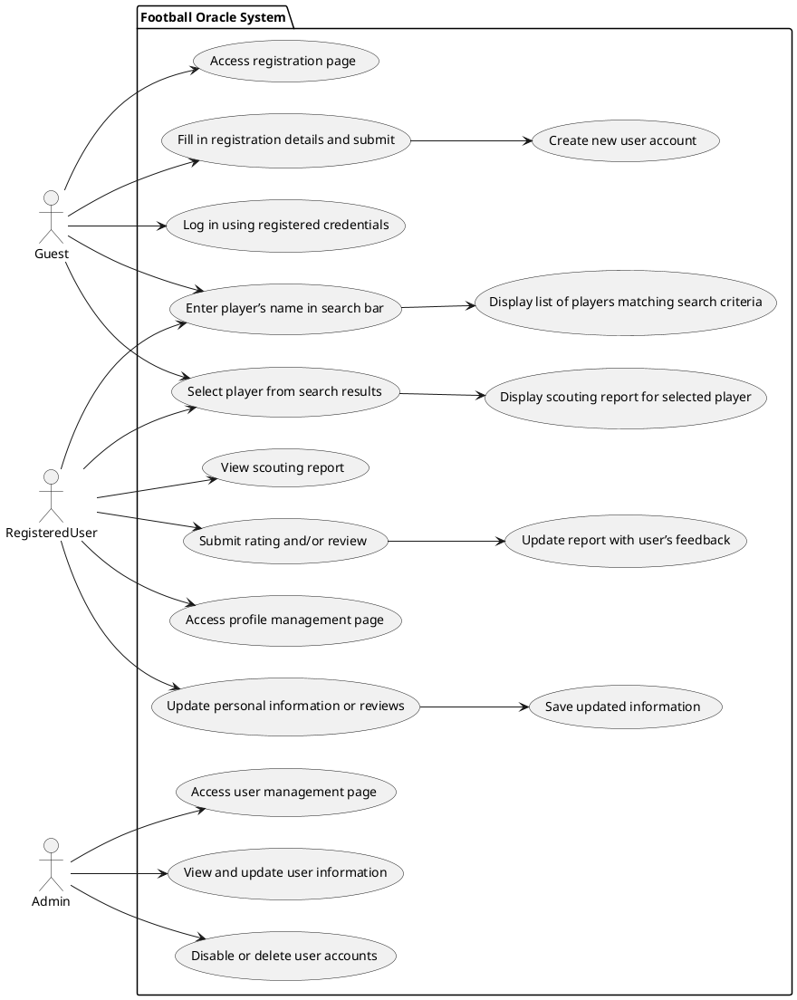

# Football Oracle: Use Cases

### 1. User Registration and Login
* Actors: Guest
* Description: A guest user registers and logs into the system.
* Steps:
  1. User accesses the registration page.
  2. User fills in registration details and submits.
  3. System creates a new user account.
  4. User logs in using the registered credentials.
  
### 2. Search for Players
* Actors: Registered User, Guest
* Description: Users search for football players.
* Steps:
  1. User enters a player’s name in the search bar.
  2. System displays a list of players matching the search criteria.

### 3. View Scouting Report
* Actors: Registered User, Guest
* Description: Users view AI-generated reports for a selected player.
* Steps:
  1. User selects a player from the search results.
  2. System displays the scouting report for the selected player.

### 4. Rate and Review Scouting Report
* Actors: Registered User
* Description: Registered users rate and review scouting reports.
* Steps:
  1. User views a scouting report.
  2. User submits a rating and/or review.
  3. System updates the report with the user’s feedback.
  
### 5. Manage User Profile
* Actors: Registered User
* Description: Users update their profile information and review history.
* Steps:
  1. User accesses the profile management page.
  2. User updates personal information or reviews.
  3. System saves the updated information.
  
### 6. Admin Manage Users
* Actors: Admin
* Description: Admin manages user accounts and content.
* Steps:
  1. Admin accesses the user management page.
  2. Admin views and updates user information.
  3. Admin can disable or delete user accounts.

